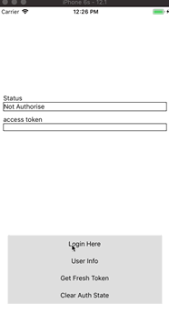

# React Native NXLAuth Examples

Example applications for the `react-native-nxlauth` library.

All the JS code can be found in `App.js`.

### Setup
1. `yarn install` or `npm install`

2. Go to ios directory

    `pod install`
    

